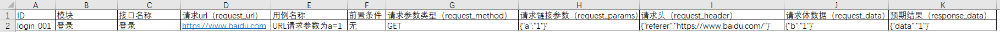

# yachi
鸭翅项目为单接口测试自动化，使用requests+unittest+HTMLTestRunner，可进行参数化接口测试，后期可自行搭配Jenkins实现自动化。
## 项目目录如下
├─yachi
    ├─Common 存放公共方法
    ├─LikeJmeter 存放接口爬取功能py文件
    └─Resource
        ├─Results 存放结果报告
        └─TestData
            └─TestCase 存放测试用例（可使用Excel文件）
            
## 项目支持Excel用例截图

